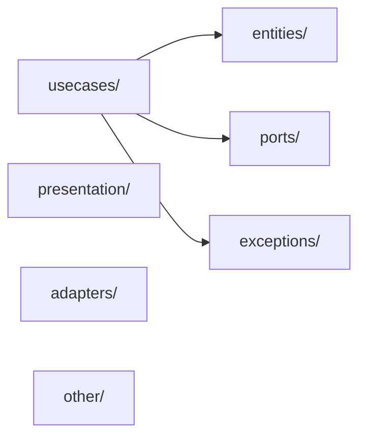

<!-- GENERATED DOCUMENT - DO NOT MODIFY BY HAND -->
<!-- Generator: scripts/flutter/gen-architecture-lint-reference.mjs -->
<!-- Source: rules/flutter/base/custom-lint/architecture_lint/lib/src/ (lints/*.dart (E2/E3 derived)) -->

# Lint Rules — Dependency Diagram (flutter/base)

> 레이어 간 import 의존성 시각화 (E2/E3 룰의 "Only ... allowed" 메시지에서 도출).
> 텍스트 조회 / 레이어 글로서리: `lint-rules-reference.md` 참조.

