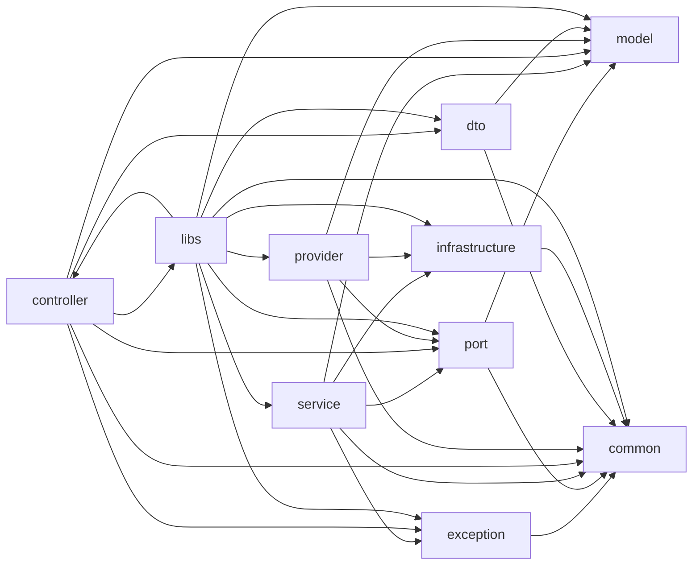

<!-- GENERATED DOCUMENT - DO NOT MODIFY BY HAND -->
<!-- Generator: scripts/gen-lint-reference.mjs -->
<!-- Source: rules/nestjs/base/eslint.rules.mjs -->

# Lint Rules Reference (nestjs/base)

## 레이어 글로서리 (Layer Glossary)

각 레이어(boundary type)가 "무엇을 담고 · 무엇을 금지하며 · 어떻게 생겼는지" 명시.
"경로·allow 매트릭스"만으로는 드러나지 않는 책임 경계·네이밍 관례·대표 코드 형태를
채워, LLM/신규 인원이 이 문서 하나로 올바른 레이어에 올바른 형태의 코드를
배치할 수 있도록 한다.

### `model`

**Role** — 도메인 Entity · Value Object · 순수 함수. 비즈니스 규칙의 단일 진실 공급원이자 프로젝트에서 가장 안정적인 레이어.

**Contains**

- Entity (interface/type) — `*.entity.ts`
- Value Object — `*.vo.ts`
- 순수 함수 — `*.functions.ts`
- 도메인 상수·공용 타입 — `*.type.ts`

**Forbids**

- ORM 엔티티 정의 (→ `provider/*.orm-entity.ts`로 분리)
- class 기반 도메인 모델 (interface/type + 순수 함수 지향)

**Scope** — Entity 필드는 `readonly` 강제 (baseImmutabilityRules). 파일 suffix 강제 대상 제외 — 파일 분할 자유.

```ts
// model/order.entity.ts
export type OrderStatus = 'pending' | 'confirmed' | 'shipped';
export interface Order {
  readonly id: string;
  readonly items: ReadonlyArray<OrderItem>;
  readonly status: OrderStatus;
}
```

### `port`

**Role** — 인바운드·아웃바운드 Port 인터페이스. service와 바깥 세계(HTTP/DB/SDK) 사이의 경계 계약. 같은 폴더에 두고 네이밍으로 방향 구분.

**Contains**

- Inbound Port (service가 구현) — `*.port.ts`
- Outbound Port (provider가 구현) — `*.port.ts`
- DI 주입 토큰 (Symbol) — `port-tokens.ts`

**Forbids**

- 프레임워크 타입 (@nestjs/*, express, class-validator 등)
- Express global namespace 참조 (`Express.Multer.File` 등 → 도메인 타입으로 변환)

**Scope** — 인터페이스 시그니처엔 model/common 타입만 사용.

```ts
// port/order-repository.port.ts  (outbound)
export interface OrderRepositoryPort {
  save(order: Order): Promise<Order>;
  findById(id: string): Promise<Order | null>;
}

// port/port-tokens.ts
export const ORDER_REPOSITORY_PORT = Symbol('OrderRepositoryPort');
```

### `service`

**Role** — Inbound Port 구현체(UseCase). Outbound Port를 주입받아 비즈니스 흐름을 조합.

**Contains**

- Service 클래스 (@Injectable, implements InboundPort) — `*.service.ts`
- 도메인 이벤트 리스너 (@OnEvent) — `*.service.ts`

**Forbids**

- @nestjs/* 대부분 (Injectable/Inject/OnEvent만 예외 허용)
- 인프라 SDK/ORM 직접 사용 (→ Outbound Port로 추상화)

**Scope** — HTTP 관심사는 controller로 분리. `*.spec.ts`는 lint 완화 (mock/stub 자유).

```ts
// service/create-order.service.ts
@Injectable()
export class CreateOrderService implements CreateOrderPort {
  constructor(
    @Inject(ORDER_REPOSITORY_PORT)
    private readonly orderRepository: OrderRepositoryPort,
  ) {}
  async execute(input: CreateOrderInput): Promise<Order> {
    return this.orderRepository.save({ ...input, id: generateId() });
  }
}
```

### `controller`

**Role** — HTTP 인바운드 어댑터. 요청 수신 → DTO 검증 → Inbound Port 호출 → Response DTO 변환.

**Contains**

- NestJS Controller 클래스 (@Controller) — `*.controller.ts`

**Forbids**

- Entity 직접 return (→ Response DTO로 매핑; local/no-entity-return)
- catch 블록의 예외 미매핑 (local/require-map-domain-exception)

**Scope** — service는 Inbound Port를 통해서만 호출 (DI 컨테이너가 Port ↔ Service 바인딩). NestJS 생태계(Guard/Pipe/Interceptor) 자유 사용.

```ts
// controller/order.controller.ts
@Controller('orders')
export class OrderController {
  constructor(
    @Inject(CREATE_ORDER_PORT)
    private readonly createOrder: CreateOrderPort,
  ) {}
  @Post()
  async create(@Body() dto: CreateOrderRequestDto): Promise<OrderResponseDto> {
    const order = await this.createOrder.execute(dto);
    return toOrderResponseDto(order);
  }
}
```

### `provider`

**Role** — Outbound Port 구현체. Port 인터페이스를 실제 ORM·외부 SDK·HTTP client로 구현.

**Contains**

- Port 구현 adapter 클래스 (@Injectable) — `*.adapter.ts`
- ORM 엔티티 (@Entity) — `*.orm-entity.ts`
- ORM ↔ Domain 매퍼 (선택) — `*.mapper.ts`

**Forbids**

- ORM 엔티티를 도메인 Entity로 재사용 (model과 분리, 매퍼로 변환)

**Scope** — `*.orm-entity.ts`의 Date 컬럼은 `timestamptz` 강제 (local/require-timestamptz). ORM/SDK 자유 사용.

```ts
// provider/order-repository.adapter.ts
@Injectable()
export class OrderRepositoryAdapter implements OrderRepositoryPort {
  constructor(
    @InjectRepository(OrderOrmEntity)
    private readonly repo: Repository<OrderOrmEntity>,
  ) {}
  async save(order: Order): Promise<Order> {
    const saved = await this.repo.save(OrderMapper.toOrm(order));
    return OrderMapper.toDomain(saved);
  }
}
```

### `exception`

**Role** — 도메인 특화 예외. controller의 `mapDomainException()`을 통해 HTTP status로 매핑된다.

**Contains**

- 도메인 예외 클래스 (extends common의 base error) — `*.error.ts`

**Forbids**

- `HttpException` 등 NestJS HTTP 타입 상속 (도메인 순수성 유지)

```ts
// exception/order-not-found.error.ts
export class OrderNotFoundError extends DomainError {
  constructor(id: string) {
    super(`Order not found: ${id}`);
  }
}
```

### `dto`

**Role** — 요청/응답 경계 타입. class-validator로 검증, class-transformer로 직렬화, @ApiProperty로 OpenAPI 스키마 생성.

**Contains**

- Request DTO — `*.request.dto.ts`
- Response DTO — `*.response.dto.ts` (클래스명 `*DataResponseDto`)
- Response 배열 원소 — `*-item.dto.ts` (클래스명 `*ItemDto`)

**Forbids**

- bare `*ResponseDto` 네이밍 (→ `*DataResponseDto`/`*ItemDto`; local/dto-naming-convention)
- Union 타입 (`A | B`) / 필드-데코레이터 nullable 불일치 (local/dto-union-type-restriction, local/dto-nullable-match)
- `oneOf` 사용 (local/no-dto-oneof)

**Scope** — 모든 필드에 `@ApiProperty` 강제 (local/require-api-property). `readonly` 강제 (baseImmutabilityRules).

```ts
// dto/create-order.request.dto.ts
export class CreateOrderRequestDto {
  @ApiProperty({ type: [OrderItemDto] })
  @ValidateNested({ each: true })
  @Type(() => OrderItemDto)
  readonly items!: readonly OrderItemDto[];
}
```

### `common`

**Role** — 전역 공용 — 모듈 로직 밖의 수평 관심사. 최하위 계층이라 상향 의존 금지.

**Contains**

- Guards·인증 유틸 — `authentication/**`
- Exception Filter·도메인 예외 베이스 — `exceptions/**`
- 공용 인터페이스 — `interfaces/**`
- Global Middleware — `middlewares/**`
- Validation Pipe — `pipes/**`
- 공용 DTO — `dtos/**`

**Forbids**

- 허용 하위 폴더 외 경로에 파일 배치 (boundaries/no-unknown-files가 거부)

### `infrastructure`

**Role** — 인프라 수평 관심사 — 프레임워크/미들웨어 수준의 부트스트랩·설정 코드.

**Contains**

- DB 설정·커넥션 — `database/**`
- I18n 설정 — `i18n/**`
- Logger 설정 — `logger/**`
- 트랜잭션 관리 — `transaction/**`

**Forbids**

- 모듈 도메인 로직 import (service/controller/provider)
- 허용 하위 폴더 외 경로 (boundaries/no-unknown-files가 거부)

### `libs`

**Role** — 독립 라이브러리성 모듈 — 앱 조립 수준에서 재사용할 수 있는 단위. 모든 레이어 참조 가능 (catch-all).

**Contains**

- 라이브러리성 모듈 (내부 구조 자유) — `src/libs/**`

**Forbids**

- 모듈 도메인 로직 이관 (원래 속한 `src/modules/<domain>/`로 유지)

## 의존성 규칙 (Dependency Rules)

레이어 간 의존성 방향 선언 (allow-list).
기본 disallow 정책 위에 아래 조합만 허용.

핵심 원칙:
  - model/port는 프레임워크와 완전 격리된 순수 TS
  - service는 controller/provider를 절대 모름 (헥사고날 역전)
  - controller는 HTTP 경계에서 DTO/port를 조합 (service 직접 호출 금지 설계)
  - provider는 Port 구현체로서 infrastructure 접근 가능
  - libs는 독립 라이브러리로 자유도 허용

### 의존성 다이어그램



### Allow 매트릭스

| From | Allow → To |
| --- | --- |
| `model` | `model` |
| `exception` | `exception`, `common` |
| `port` | `model`, `common` |
| `service` | `model`, `port`, `exception`, `common`, `infrastructure` |
| `controller` | `port`, `dto`, `model`, `exception`, `common`, `libs` |
| `provider` | `port`, `model`, `common`, `infrastructure`, `provider` |
| `dto` | `model`, `common`, `dto` |
| `common` | `common` |
| `infrastructure` | `infrastructure`, `common` |
| `libs` | `model`, `port`, `service`, `controller`, `provider`, `exception`, `dto`, `common`, `infrastructure`, `libs` |

## Framework 금지 패키지 (순수 레이어 차단)

"프레임워크" 패키지 목록 — 순수 레이어(model/, port/, exception/)에서 금지.
이 계층들은 프레임워크 중립이어야 테스트 용이성과 이식성이 보장된다.
- @nestjs/*   : Nest DI/데코레이터
- class-validator / class-transformer : DTO 검증 (boundary에서만 사용)
- express     : HTTP 어댑터 (controller/provider 계층 관심사)

- `@nestjs/*`
- `class-validator`
- `class-transformer`
- `express`
- `express/*`

## Ignored Paths (무시 경로)

Boundary 검사에서 제외할 파일/디렉토리.
- 테스트 파일 : 레이어 경계와 무관 (mock import 자유롭게 허용)
- .module.ts : DI 조립 파일이라 모든 레이어를 import해야 함
- main.ts, app.*.ts : 앱 부트스트랩
- src/modules/health : 헬스체크 유틸 (인프라/컨트롤러 혼합 정상)
- 모듈 내부 common 디렉토리 : 모듈 내 공용 (모든 하위 레이어에서 참조)

### 무시 패턴 목록

- `**/*.spec.ts`
- `**/*.test.ts`
- `**/*.module.ts`
- `src/main.ts`
- `src/app.*.ts`
- `src/test/**`
- `src/modules/health/**`
- `src/modules/**/common/**`
- `test/**`
- `.jkit/**`
- `eslint.config.mjs`
- `eslint-rules/**`
- `dist/**`
- `coverage/**`
