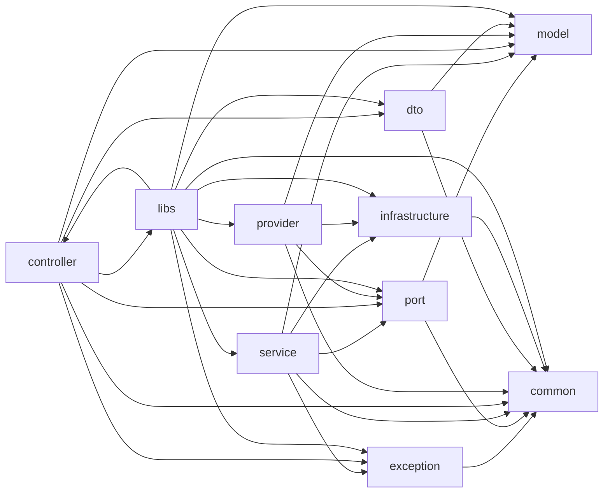

<!-- GENERATED DOCUMENT - DO NOT MODIFY BY HAND -->
<!-- Generator: scripts/gen-lint-reference.mjs -->
<!-- Source: rules/nestjs/base/eslint.rules.mjs -->

# Lint Rules Reference (nestjs/base)

## 의존성 규칙 (Dependency Rules)

레이어 간 의존성 방향 선언 (allow-list).
기본 disallow 정책 위에 아래 조합만 허용.

핵심 원칙:
  - model/port는 프레임워크와 완전 격리된 순수 TS
  - service는 controller/provider를 절대 모름 (헥사고날 역전)
  - controller는 HTTP 경계에서 DTO/port를 조합 (service 직접 호출 금지 설계)
  - provider는 Port 구현체로서 infrastructure 접근 가능
  - libs는 독립 라이브러리로 자유도 허용

### 의존성 다이어그램

### Allow 매트릭스

| From | Allow → To |
| --- | --- |
| `model` | `model` |
| `exception` | `exception`, `common` |
| `port` | `model`, `common` |
| `service` | `model`, `port`, `exception`, `common`, `infrastructure` |
| `controller` | `port`, `dto`, `model`, `exception`, `common`, `libs` |
| `provider` | `port`, `model`, `common`, `infrastructure`, `provider` |
| `dto` | `model`, `common`, `dto` |
| `common` | `common` |
| `infrastructure` | `infrastructure`, `common` |
| `libs` | `model`, `port`, `service`, `controller`, `provider`, `exception`, `dto`, `common`, `infrastructure`, `libs` |

## Ignored Paths (무시 경로)

Boundary 검사에서 제외할 파일/디렉토리.
- 테스트 파일 : 레이어 경계와 무관 (mock import 자유롭게 허용)
- .module.ts : DI 조립 파일이라 모든 레이어를 import해야 함
- main.ts, app.*.ts : 앱 부트스트랩
- src/modules/health : 헬스체크 유틸 (인프라/컨트롤러 혼합 정상)
- 모듈 내부 common 디렉토리 : 모듈 내 공용 (모든 하위 레이어에서 참조)

### 무시 패턴 목록

- `**/*.spec.ts`
- `**/*.test.ts`
- `**/*.module.ts`
- `src/main.ts`
- `src/app.*.ts`
- `src/test/**`
- `src/modules/health/**`
- `src/modules/**/common/**`
- `test/**`
- `.jkit/**`
- `eslint.config.mjs`
- `eslint-rules/**`
- `dist/**`
- `coverage/**`
