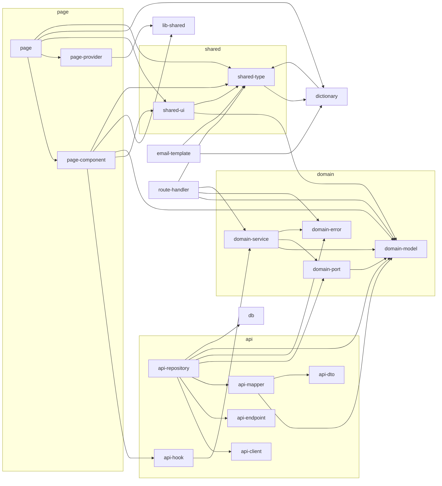

<!-- GENERATED DOCUMENT - DO NOT MODIFY BY HAND -->
<!-- Generator: scripts/typescript/gen-eslint-reference.mjs -->
<!-- Source: rules/nextjs/base/eslint.rules.mjs (baseBoundaryRules) -->

# Lint Rules — Dependency Diagram (nextjs/base)

> 레이어 간 의존성 시각화 (`baseBoundaryRules` allow-list 기반).
> 텍스트 조회 / Allow 매트릭스 / 레이어별 상세: `lint-rules-reference.md` 참조.

