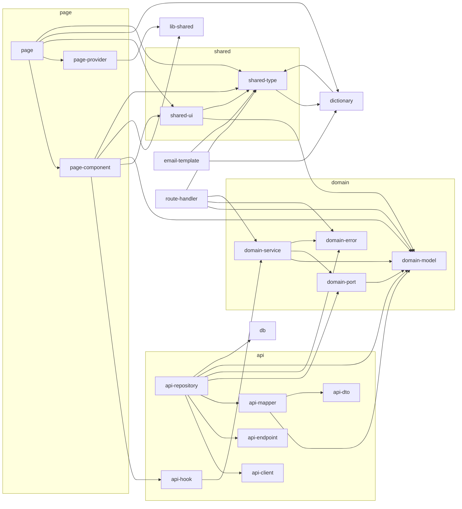

<!-- GENERATED DOCUMENT - DO NOT MODIFY BY HAND -->
<!-- Generator: scripts/gen-lint-reference.mjs -->
<!-- Source: rules/nextjs/base/eslint.rules.mjs -->

# Lint Rules Reference (nextjs/base)

## 레이어 글로서리 (Layer Glossary)

각 레이어(boundary type)가 "무엇을 담고 · 무엇을 금지하며 · 어떻게 생겼는지" 명시.
"경로·allow 매트릭스"만으로는 드러나지 않는 책임 경계·네이밍 관례·대표 코드 형태를
채워, LLM/신규 인원이 이 문서 하나로 올바른 레이어에 올바른 형태의 코드를
배치할 수 있도록 한다.

### `domain-model`

**Role** — 도메인 Entity · Value Object · 공용 타입. 프레임워크 비의존 순수 TypeScript로, 프로젝트 전역에서 참조되는 가장 안정적인 계약.

**Contains**

- Entity 타입 (interface/type) — `*.model.ts`
- Value Object — `*.vo.ts`

**Forbids**

- React/Next.js import (baseDomainBannedPackages)
- DB 드라이버 import (mongodb, pg, redis, typeorm 등)
- class 기반 도메인 (interface/type + 순수 함수 지향)

```ts
// src/lib/domain/models/order.model.ts
export type OrderStatus = 'pending' | 'confirmed' | 'shipped';
export interface Order {
  readonly id: string;
  readonly items: ReadonlyArray<OrderItem>;
  readonly status: OrderStatus;
}
```

### `domain-error`

**Role** — 도메인 특화 에러 타입. UI/API 레이어에서 `instanceof`로 식별해 사용자 메시지 매핑.

**Contains**

- 도메인 에러 클래스 — `*.error.ts`

**Forbids**

- React/Next.js/DB 드라이버 import (domain layer 동일 제약)

```ts
// src/lib/domain/errors/order-not-found.error.ts
export class OrderNotFoundError extends Error {
  constructor(public readonly id: string) {
    super(`Order not found: ${id}`);
  }
}
```

### `domain-port`

**Role** — Repository·외부 의존 인터페이스. domain-service가 주입받아 쓰는 경계 계약.

**Contains**

- Repository Port — `*-repository.port.ts`
- 기타 outbound port (알림·결제·캐시 등) — `*.port.ts`

**Forbids**

- 인터페이스 시그니처에 프레임워크 타입 (model/error만 사용)
- 구현 코드 (→ api-repository)

```ts
// src/lib/domain/ports/order-repository.port.ts
export interface OrderRepositoryPort {
  findById(id: string): Promise<Order | null>;
  findAll(): Promise<Order[]>;
}
```

### `domain-service`

**Role** — UseCase·비즈니스 로직 조합기. Port를 주입받아 도메인 흐름을 orchestrate.

**Contains**

- Service 클래스 — `*.service.ts`

**Forbids**

- React Hook 호출 (`use*` — UI 전용)
- api-repository 직접 import (→ domain-port 주입으로만)

```ts
// src/lib/domain/services/order.service.ts
export class OrderService {
  constructor(private readonly orderRepository: OrderRepositoryPort) {}
  async getOrder(id: string): Promise<Order> {
    const order = await this.orderRepository.findById(id);
    if (!order) throw new OrderNotFoundError(id);
    return order;
  }
}
```

### `api-client`

**Role** — HTTP 클라이언트 단일 파일 (axios/fetch/ky 래퍼). baseURL·인터셉터·에러 포맷팅 공통화.

**Contains**

- client 인스턴스 export — `src/lib/api/client.ts` (단일 파일)

**Forbids**

- 이 파일에서 다른 레이어 import (순수 통신 경계; allow: [])

### `api-endpoint`

**Role** — 엔드포인트 URL 상수 단일 파일. API 경로 변경 시 단일 지점 수정.

**Contains**

- URL 상수 export — `src/lib/api/endpoints.ts` (단일 파일)

**Forbids**

- 런타임 로직·동적 URL 생성 (상수 객체만)
- 다른 레이어 import (allow: [])

### `api-dto`

**Role** — 외부 API 응답 타입 단일 파일. 백엔드 계약을 코드로 표현 (snake_case 등 원형 유지).

**Contains**

- DTO 타입 export — `src/lib/api/types.ts` (단일 파일)

**Forbids**

- 도메인 변환 로직 (→ api-mapper)
- 다른 레이어 import (allow: [])

### `api-mapper`

**Role** — DTO ↔ Domain Model 변환 전담. snake_case → camelCase, nullable 정규화, enum 매핑 등.

**Contains**

- Mapper 클래스 (static 메서드) — `*.mapper.ts`

**Forbids**

- 비즈니스 로직 (순수 변환만; 계산/조합은 domain-service)

```ts
// src/lib/api/mappers/order.mapper.ts
export class OrderMapper {
  static toDomain(dto: OrderDto): Order {
    return {
      id: dto.id,
      items: dto.items.map(ItemMapper.toDomain),
      status: dto.status,
      totalAmount: dto.total_amount,
    };
  }
}
```

### `api-repository`

**Role** — domain-port 구현체. api-client로 HTTP 호출 후 api-mapper로 Domain 타입 변환.

**Contains**

- Repository 클래스 (implements *Port) — `*.repository.ts`

**Forbids**

- 비즈니스 로직 (통신·변환만)
- repository 간 상호 import (cross-repository 의존 금지)

```ts
// src/lib/api/repositories/order.repository.ts
export class OrderRepository implements OrderRepositoryPort {
  async findById(id: string): Promise<Order | null> {
    const dto = await apiClient.get<OrderDto>(`${ENDPOINTS.ORDERS}/${id}`);
    return dto ? OrderMapper.toDomain(dto) : null;
  }
}
```

### `api-hook`

**Role** — UI에 제공되는 데이터 페칭 훅 (TanStack Query 등). domain-service만 호출 — Repository 직접 호출 금지.

**Contains**

- React Query 훅 (useQuery/useMutation) — `use-*.ts`
- Service 팩토리 훅 — `use-*-service.ts`

**Forbids**

- api-repository 직접 import (→ domain-service 경유)
- UI 컴포넌트 import (훅은 데이터 계약만)

```ts
// src/lib/api/hooks/use-order.ts
export function useOrder(id: string) {
  const service = useOrderService();
  return useQuery({
    queryKey: ['order', id],
    queryFn: () => service.getOrder(id),
  });
}
```

### `lib-shared`

**Role** — `src/lib/` 루트의 공용 유틸. 내부 의존 0 — 다른 레이어 import 금지 (allow: []).

**Contains**

- 순수 유틸 함수 — `src/lib/*.ts` (루트 단일 파일 한정)

**Forbids**

- 다른 레이어 import (순수 유틸 경계 유지)

### `db`

**Role** — DB 드라이버 래퍼 — 클라이언트 초기화·커넥션 풀·트랜잭션 관리. MongoDB/PostgreSQL/Redis/TypeORM 드라이버 무관.

**Contains**

- DB 클라이언트 팩토리·커넥션 헬퍼 — `src/lib/db/*.ts`

**Forbids**

- 프로젝트 내 다른 레이어 import (순수 래퍼; allow: [])

### `shared-ui`

**Role** — 전역 재사용 Client Component. 도메인 모델은 타입 표현용으로만 참조 — domain-service 호출 금지.

**Contains**

- Presentational Component — `src/components/<name>/<Name>.tsx`
- 컴포넌트 전용 util/hook (콜로케이션)

**Forbids**

- api-hook 호출 (데이터 페칭은 page-component에서)
- `React.FC` / `React.FunctionComponent` (baseRestrictedSyntax)

```ts
// src/components/order-summary/order-summary.tsx
'use client';
export function OrderSummary({ order }: { order: Order }) {
  return <div>{order.totalAmount}</div>;
}
```

### `page-component`

**Role** — 페이지 전용 Client Component. `src/app/[locale]/**/_components/`에 콜로케이션. api-hook으로 데이터 조회 + shared-ui 조합.

**Contains**

- `'use client'` Client Component — `_components/<name>.tsx`

**Forbids**

- domain-service 직접 호출 (→ api-hook을 통해서)
- `React.FC` 사용 (baseRestrictedSyntax)

```ts
// src/app/[locale]/orders/_components/order-list.tsx
'use client';
export function OrderList() {
  const { data, isLoading } = useOrders();
  if (isLoading) return <Spinner />;
  return <ul>{data?.map((o) => <li key={o.id}>{o.id}</li>)}</ul>;
}
```

### `page-provider`

**Role** — 페이지 전용 Provider — 설정/컨텍스트 래퍼. 공용 유틸(lib-shared)만 import.

**Contains**

- Context Provider Client Component — `_providers/<name>.tsx`

**Forbids**

- 도메인/API 레이어 import (설정 전달에만 집중)

### `dictionary`

**Role** — i18n 사전. 로케일별 메시지 객체 + 타입 안전 키 (shared-type과 상호 참조).

**Contains**

- 사전 파일 — `src/common/dictionaries/*.ts`
- 로케일 loader — `src/app/[locale]/dictionaries.ts`

**Forbids**

- 런타임 비즈니스 로직 (순수 데이터 객체)

### `shared-type`

**Role** — 프로젝트 전역 타입 선언 (i18n 키 타입 등). `src/common/types/**`에 배치.

**Contains**

- 전역 타입 선언 — `src/common/types/*.ts`

**Forbids**

- 런타임 코드 (타입 선언 전용)

### `email-template`

**Role** — 이메일 전송 시 서버에서 렌더링되는 React Email 템플릿. 필요 데이터는 props로 주입받음.

**Contains**

- React Email 컴포넌트 — `src/lib/email-templates/*.tsx`

**Forbids**

- 도메인/API 레이어 import (서버 전용 로직 유출 방지)

### `route-handler`

**Role** — Next.js App Router HTTP 엔드포인트 — GET/POST/PUT/DELETE 등 export하는 얇은 HTTP 어댑터.

**Contains**

- HTTP 핸들러 export — `src/app/**/route.ts`

**Forbids**

- UI 레이어 import (shared-ui/page-component 금지; 서버 경계 위반)
- 비즈니스 로직 포함 (→ domain-service 호출에 집중)

```ts
// src/app/api/orders/[id]/route.ts
export async function GET(
  req: Request,
  { params }: { params: { id: string } },
) {
  const order = await orderService.getOrder(params.id);
  return Response.json(order);
}
```

### `page`

**Role** — `src/app` 최상위 컨슈머 (Server Component). 위 패턴에 매칭 안 된 App Router 파일의 catch-all.

**Contains**

- Server Component 페이지 — `page.tsx`
- Layout — `layout.tsx`
- Loading/Error boundary — `loading.tsx`, `error.tsx`, `not-found.tsx`

**Forbids**

- Hook 호출 (Server Component는 `use*` 호출 금지; baseServerComponentRules)
- domain-service/api-hook 직접 호출 (→ page-component를 거쳐야 함)

## 의존성 규칙 (Dependency Rules)

레이어 간 의존성 방향 선언 (allow-list).
기본 `disallow` 정책 위에 `allow`된 조합만 import를 허용한다.
핵심 원칙:
  - 도메인은 외부 레이어를 모른다 (단방향: UI/API → Domain)
  - API 원시 계층(client/endpoint/dto)은 어떤 레이어도 import 하지 않는다
  - UI는 도메인 모델만 참조하고 도메인 서비스 호출은 hook을 통해서만
  - Page는 최상위 컨슈머 (UI + dictionary 등 조합)

### 의존성 다이어그램



### Allow 매트릭스

| From | Allow → To |
| --- | --- |
| `domain-model` | `domain-model` |
| `domain-error` | `domain-error` |
| `domain-port` | `domain-model` |
| `domain-service` | `domain-model`, `domain-port`, `domain-error`, `domain-service` |
| `api-client` | _(없음)_ |
| `api-endpoint` | _(없음)_ |
| `api-dto` | _(없음)_ |
| `api-mapper` | `domain-model`, `api-dto` |
| `api-repository` | `api-client`, `api-endpoint`, `api-mapper`, `domain-port`, `domain-error`, `domain-model`, `db` |
| `api-hook` | `domain-service` |
| `lib-shared` | _(없음)_ |
| `db` | _(없음)_ |
| `shared-ui` | `domain-model`, `shared-ui`, `shared-type` |
| `page-component` | `api-hook`, `shared-ui`, `domain-model`, `page-component`, `lib-shared`, `shared-type` |
| `page-provider` | `lib-shared` |
| `dictionary` | `shared-type`, `dictionary` |
| `shared-type` | `dictionary` |
| `email-template` | `dictionary`, `shared-type` |
| `route-handler` | `domain-model`, `domain-error`, `domain-service`, `shared-type` |
| `page` | `page-component`, `page-provider`, `shared-ui`, `dictionary`, `shared-type`, `page` |

## Restricted Patterns (Import 금지 패턴)

전역 no-restricted-imports 패턴.
- 깊은 상대경로(`../../**`)를 금지하여 폴더 구조 리팩토링 시 import가 깨지는 것을
  방지하고, `@/*` path alias 사용을 강제한다.
- 스택별 rules.mjs에서 패턴을 추가로 머지할 수 있도록 export.

| 패턴 | 메시지 |
| --- | --- |
| `../../**` | Use @/* path alias instead of deep relative parent imports. |

## Restricted Syntax (AST 금지 구문)

AST selector 기반 금지 구문.
- `React.FC` / `React.FunctionComponent` 금지
  이유: children을 암묵적으로 포함해 props 계약을 흐리고, generic 사용이 어렵다.
  공식 React 팀도 더 이상 권장하지 않음 (명시적 props 타입 권장).

| Selector | 메시지 |
| --- | --- |
| `TSTypeReference[typeName.object.name='React'][typeName.property.name='FC']` | Use explicit props typing instead of React.FC. |
| `TSTypeReference[typeName.object.name='React'][typeName.property.name='FunctionComponent']` | Use explicit props typing instead of React.FunctionComponent. |

## Domain Purity (도메인 순수성)

도메인 레이어에서 금지하는 패키지 목록.
도메인 레이어(`src/lib/domain/**`)는 프레임워크 비의존 순수 TypeScript여야 하며
React/Next.js 타입·런타임에 직접 의존하면 안 된다.
스택별로 UI 라이브러리(Mantine, Tailwind, TanStack Query 등)를 추가 차단한다.

### 도메인 레이어 금지 패키지

- `react`
- `react/**`
- `react-dom`
- `react-dom/**`
- `next`
- `next/**`
- `mongodb`
- `mongodb/**`
- `pg`
- `pg/**`
- `redis`
- `redis/**`
- `typeorm`
- `typeorm/**`

## Rule Overrides (룰 오버라이드)

프로젝트 공용 ESLint 베이스 config.
블록 순서 중요: 뒤의 config가 앞의 config를 override한다.
  1) Next.js 공식 config (core-web-vitals + typescript)
  2) typescript-eslint 타입 기반 룰
  3) Prettier (포맷 관련 룰 비활성화 — 포맷은 Prettier 전담)
  4) SonarJS (코드 스멜/복잡도)
  5) simple-import-sort + unused-imports (import 정리)
  6) 프로젝트 공통 스타일 룰

| 룰 | Severity | 옵션 |
| --- | --- | --- |
| `@typescript-eslint/consistent-type-imports` | `error` | `{"prefer":"type-imports","fixStyle":"inline-type-imports"}` |
| `@typescript-eslint/no-deprecated` | `error` | — |
| `prefer-const` | `error` | — |
| `react/function-component-definition` | `error` | `{"namedComponents":["function-declaration","arrow-function"],"unnamedComponents":"arrow-function"}` |
| `simple-import-sort/exports` | `error` | — |
| `simple-import-sort/imports` | `error` | — |
| `unused-imports/no-unused-imports` | `error` | — |
| `@typescript-eslint/no-explicit-any` | `warn` | — |
| `no-console` | `warn` | `{"allow":["warn","error"]}` |
| `sonarjs/no-nested-conditional` | `warn` | — |
| `unused-imports/no-unused-vars` | `warn` | `{"vars":"all","varsIgnorePattern":"^_","args":"after-used","argsIgnorePattern":"^_"}` |
| `@typescript-eslint/no-base-to-string` | `off` | — |
| `@typescript-eslint/no-floating-promises` | `off` | — |
| `@typescript-eslint/no-misused-promises` | `off` | — |
| `@typescript-eslint/no-redundant-type-constituents` | `off` | — |
| `@typescript-eslint/no-unsafe-argument` | `off` | — |
| `@typescript-eslint/no-unsafe-assignment` | `off` | — |
| `@typescript-eslint/no-unsafe-call` | `off` | — |
| `@typescript-eslint/no-unsafe-member-access` | `off` | — |
| `@typescript-eslint/no-unsafe-return` | `off` | — |
| `@typescript-eslint/no-unused-vars` | `off` | — |
| `@typescript-eslint/require-await` | `off` | — |
| `@typescript-eslint/restrict-template-expressions` | `off` | — |
| `@typescript-eslint/unbound-method` | `off` | — |
| `sonarjs/todo-tag` | `off` | — |

## Ignored Paths (무시 경로)

Boundary 검사에서 제외할 파일/디렉토리 (boundaries/no-unknown-files 오탐 방지).
- 테스트/스펙/설정 파일: 레이어 경계와 무관
- 루트 `*.ts` / `*.d.ts`: next-env.d.ts 같은 메타 파일
- `scripts/`, `e2e/`: 빌드·테스트 유틸, 앱 소스가 아님
- `src/common/types/**`: 전역 타입 선언, 레이어 개념 밖

### 무시 패턴 목록

- `**/*.test.ts`
- `**/*.test.tsx`
- `**/*.spec.ts`
- `**/*.spec.tsx`
- `*.config.*`
- `*.ts`
- `*.d.ts`
- `types/**`
- `src/common/types/**`
- `.jkit/**`
- `scripts/**`
- `e2e/**`
- `.next/**`
- `out/**`
- `build/**`
- `coverage/**`
- `next-env.d.ts`
