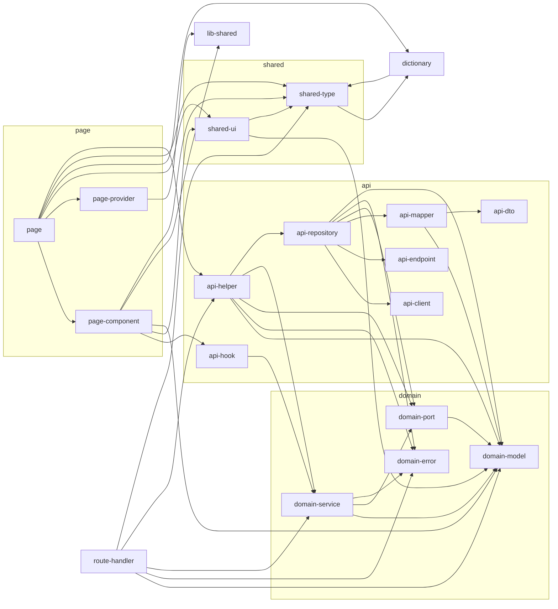

# Lint Rules Reference (nextjs/base)

> 이 문서는 `rules/nextjs/base/eslint.base.mjs` 에서 자동 생성됩니다.
> **수동 편집 금지** — 변경은 `.mjs` 에서 하고 `node scripts/gen-lint-reference.mjs`를 다시 실행하세요.

## 의존성 규칙 (Dependency Rules)

레이어 간 의존성 방향 선언 (allow-list).
기본 `disallow` 정책 위에 `allow`된 조합만 import를 허용한다.
핵심 원칙:
  - 도메인은 외부 레이어를 모른다 (단방향: UI/API → Domain)
  - API 원시 계층(client/endpoint/dto)은 어떤 레이어도 import 하지 않는다
  - UI는 도메인 모델만 참조하고 도메인 서비스 호출은 hook을 통해서만
  - Page는 최상위 컨슈머 (UI + api-helper + dictionary 등 조합)

### 의존성 다이어그램

### Allow 매트릭스

| From | Allow → To |
| --- | --- |
| `domain-model` | `domain-model` |
| `domain-error` | `domain-error` |
| `domain-port` | `domain-model` |
| `domain-service` | `domain-model`, `domain-port`, `domain-error`, `domain-service` |
| `api-client` | _(없음)_ |
| `api-endpoint` | _(없음)_ |
| `api-dto` | _(없음)_ |
| `api-mapper` | `domain-model`, `api-dto` |
| `api-repository` | `api-client`, `api-endpoint`, `api-mapper`, `domain-port`, `domain-error`, `domain-model` |
| `api-hook` | `domain-service` |
| `api-helper` | `domain-model`, `domain-error`, `domain-port`, `domain-service`, `api-repository`, `api-helper` |
| `lib-shared` | _(없음)_ |
| `shared-ui` | `domain-model`, `shared-ui`, `shared-type` |
| `page-component` | `api-hook`, `shared-ui`, `domain-model`, `page-component`, `lib-shared`, `shared-type` |
| `page-provider` | `lib-shared` |
| `dictionary` | `shared-type`, `dictionary` |
| `shared-type` | `dictionary` |
| `route-handler` | `domain-model`, `domain-error`, `domain-service`, `api-helper`, `shared-type` |
| `page` | `page-component`, `page-provider`, `shared-ui`, `dictionary`, `shared-type`, `api-helper`, `page` |

## Restricted Patterns (Import 금지 패턴)

전역 no-restricted-imports 패턴.
- 깊은 상대경로(`../../**`)를 금지하여 폴더 구조 리팩토링 시 import가 깨지는 것을
  방지하고, `@/*` path alias 사용을 강제한다.
- 스택별 rules.mjs에서 패턴을 추가로 머지할 수 있도록 export.

| 패턴 | 메시지 |
| --- | --- |
| `../../**` | Use @/* path alias instead of deep relative parent imports. |

## Restricted Syntax (AST 금지 구문)

AST selector 기반 금지 구문.
- `React.FC` / `React.FunctionComponent` 금지
  이유: children을 암묵적으로 포함해 props 계약을 흐리고, generic 사용이 어렵다.
  공식 React 팀도 더 이상 권장하지 않음 (명시적 props 타입 권장).

| Selector | 메시지 |
| --- | --- |
| `TSTypeReference[typeName.object.name='React'][typeName.property.name='FC']` | Use explicit props typing instead of React.FC. |
| `TSTypeReference[typeName.object.name='React'][typeName.property.name='FunctionComponent']` | Use explicit props typing instead of React.FunctionComponent. |

## Domain Purity (도메인 순수성)

도메인 레이어에서 금지하는 패키지 목록.
도메인 레이어(`src/lib/domain/**`)는 프레임워크 비의존 순수 TypeScript여야 하며
React/Next.js 타입·런타임에 직접 의존하면 안 된다.
스택별로 UI 라이브러리(Mantine, Tailwind, TanStack Query 등)를 추가 차단한다.

### 도메인 레이어 금지 패키지

- `react`
- `react/**`
- `react-dom`
- `react-dom/**`
- `next`
- `next/**`

## Rule Overrides (룰 오버라이드)

프로젝트 공용 ESLint 베이스 config.
블록 순서 중요: 뒤의 config가 앞의 config를 override한다.
  1) Next.js 공식 config (core-web-vitals + typescript)
  2) typescript-eslint 타입 기반 룰
  3) Prettier (포맷 관련 룰 비활성화 — 포맷은 Prettier 전담)
  4) SonarJS (코드 스멜/복잡도)
  5) simple-import-sort + unused-imports (import 정리)
  6) 프로젝트 공통 스타일 룰

| 룰 | Severity | 옵션 |
| --- | --- | --- |
| `@typescript-eslint/consistent-type-imports` | `error` | `{"prefer":"type-imports","fixStyle":"inline-type-imports"}` |
| `@typescript-eslint/no-deprecated` | `error` | — |
| `prefer-const` | `error` | — |
| `react/function-component-definition` | `error` | `{"namedComponents":["function-declaration","arrow-function"],"unnamedComponents":"arrow-function"}` |
| `simple-import-sort/exports` | `error` | — |
| `simple-import-sort/imports` | `error` | — |
| `unused-imports/no-unused-imports` | `error` | — |
| `@typescript-eslint/no-explicit-any` | `warn` | — |
| `no-console` | `warn` | `{"allow":["warn","error"]}` |
| `sonarjs/no-nested-conditional` | `warn` | — |
| `unused-imports/no-unused-vars` | `warn` | `{"vars":"all","varsIgnorePattern":"^_","args":"after-used","argsIgnorePattern":"^_"}` |
| `@typescript-eslint/no-base-to-string` | `off` | — |
| `@typescript-eslint/no-floating-promises` | `off` | — |
| `@typescript-eslint/no-misused-promises` | `off` | — |
| `@typescript-eslint/no-redundant-type-constituents` | `off` | — |
| `@typescript-eslint/no-unsafe-argument` | `off` | — |
| `@typescript-eslint/no-unsafe-assignment` | `off` | — |
| `@typescript-eslint/no-unsafe-call` | `off` | — |
| `@typescript-eslint/no-unsafe-member-access` | `off` | — |
| `@typescript-eslint/no-unsafe-return` | `off` | — |
| `@typescript-eslint/no-unused-vars` | `off` | — |
| `@typescript-eslint/require-await` | `off` | — |
| `@typescript-eslint/restrict-template-expressions` | `off` | — |
| `@typescript-eslint/unbound-method` | `off` | — |
| `sonarjs/todo-tag` | `off` | — |

## Ignored Paths (무시 경로)

Boundary 검사에서 제외할 파일/디렉토리 (boundaries/no-unknown-files 오탐 방지).
- 테스트/스펙/설정 파일: 레이어 경계와 무관
- 루트 `*.ts` / `*.d.ts`: next-env.d.ts 같은 메타 파일
- `scripts/`, `e2e/`: 빌드·테스트 유틸, 앱 소스가 아님
- `src/common/types/**`: 전역 타입 선언, 레이어 개념 밖

### 무시 패턴 목록

- `**/*.test.ts`
- `**/*.test.tsx`
- `**/*.spec.ts`
- `**/*.spec.tsx`
- `*.config.*`
- `*.ts`
- `*.d.ts`
- `types/**`
- `src/common/types/**`
- `.jkit/**`
- `scripts/**`
- `e2e/**`
- `.next/**`
- `out/**`
- `build/**`
- `coverage/**`
- `next-env.d.ts`
