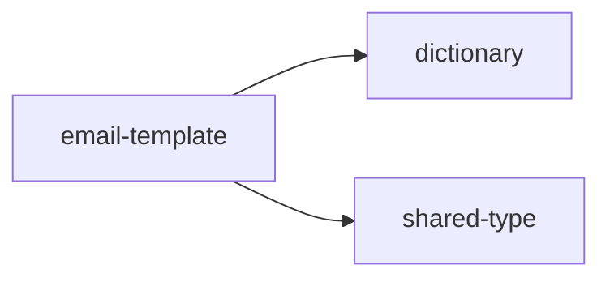

<!-- GENERATED DOCUMENT - DO NOT MODIFY BY HAND -->
<!-- Generator: scripts/gen-lint-reference.mjs -->
<!-- Source: rules/nextjs/email-template/eslint.rules.mjs -->

# Lint Rules Reference (nextjs/email-template)

## 의존성 규칙 (Dependency Rules)

이메일 템플릿이 i18n 사전과 공통 타입만 접근하도록 제한.
도메인/API 레이어를 직접 import하면 서버 전용 로직이 이메일 렌더 경로로 새게 된다.
필요한 데이터는 호출자(api-helper)가 props로 주입해야 한다.

### 의존성 다이어그램

### Allow 매트릭스

| From | Allow → To |
| --- | --- |
| `email-template` | `dictionary`, `shared-type` |

## Boundary Allow Patches (base 규칙 추가 허용)

api-helper가 이메일 템플릿을 import하여 렌더 후 발송할 수 있도록 허용.
(이메일 발송의 최상위 조립 지점이 api-helper인 설계)

| From | 추가 허용 (To) |
| --- | --- |
| `api-helper` | `email-template` |
