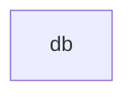

<!-- GENERATED DOCUMENT - DO NOT MODIFY BY HAND -->
<!-- Generator: scripts/gen-lint-reference.mjs -->
<!-- Source: rules/nextjs/mongodb/eslint.rules.mjs -->

# Lint Rules Reference (nextjs/mongodb)

## 의존성 규칙 (Dependency Rules)

DB 레이어는 프로젝트 내 어떤 element도 import 하지 않는다 (순수 드라이버 래퍼).
mongodb 패키지는 외부 의존이므로 element 규칙 대상 아님 → allow: [] 로 충분.

### 의존성 다이어그램

### Allow 매트릭스

| From | Allow → To |
| --- | --- |
| `db` | _(없음)_ |

## Boundary Allow Patches (base 규칙 추가 허용)

기존 base의 `api-repository` 허용 목록에 `db` 접근을 추가.
Repository는 도메인 Port를 구현하면서 DB 드라이버를 실제로 호출하는 계층이므로
`api-repository → db` import가 필요하다.

| From | 추가 허용 (To) |
| --- | --- |
| `api-repository` | `db` |

## Domain Purity (도메인 순수성)

도메인 레이어에서 mongodb 드라이버 import 전면 차단.
도메인 서비스가 직접 DB를 만지면 순수성·테스트 용이성이 깨진다.
DB 접근은 Port(인터페이스) → Repository 구현 경로로만 허용.

### 도메인 레이어 금지 패키지

- `mongodb`
- `mongodb/**`
