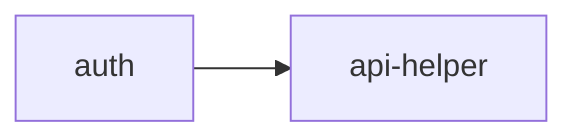

<!-- GENERATED DOCUMENT - DO NOT MODIFY BY HAND -->
<!-- Generator: scripts/gen-lint-reference.mjs -->
<!-- Source: rules/nextjs/nextauth/eslint.rules.mjs -->

# Lint Rules Reference (nextjs/nextauth)

## 의존성 규칙 (Dependency Rules)

auth.ts는 NextAuth 설정 구성을 위해 api-helper만 import 가능
(예: DB 어댑터 초기화, 커스텀 콜백에서 api 조회 등).
domain/UI 직접 의존은 금지.

### 의존성 다이어그램

### Allow 매트릭스

| From | Allow → To |
| --- | --- |
| `auth` | `api-helper` |

## Boundary Allow Patches (base 규칙 추가 허용)

기존 레이어가 auth.ts를 참조할 수 있도록 허용 목록에 추가:
  - api-helper → auth  : 서버 액션/핸들러에서 `auth()` 호출로 세션 조회
  - page       → auth  : 페이지/레이아웃에서 `auth()`로 서버 사이드 세션 확인

| From | 추가 허용 (To) |
| --- | --- |
| `api-helper` | `auth` |
| `page` | `auth` |

## Domain Purity (도메인 순수성)

도메인 레이어에서 next-auth import 금지.
인증은 어댑터 레이어 관심사이며 도메인 로직은 auth 구현체에 의존하면 안 된다.
사용자·세션 개념이 도메인에 필요하면 해당 모델을 도메인 내부에 별도 정의한다.

### 도메인 레이어 금지 패키지

- `next-auth`
- `next-auth/**`
